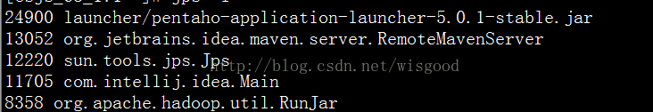

jps是jdk提供的一个查看当前java进程的小工具， 可以看做是JavaVirtual Machine Process Status Tool的缩写。非常简单实用。
       命令格式：jps [options ] [ hostid ] 

[options]选项 ：
-q：仅输出VM标识符，不包括classname,jar name,arguments in main method 
-m：输出main method的参数 
-l：输出完全的包名，应用主类名，jar的完全路径名 
-v：输出jvm参数 
-V：输出通过flag文件传递到JVM中的参数(.hotspotrc文件或-XX:Flags=所指定的文件 
-Joption：传递参数到vm,例如:-J-Xms512m

        [hostid]：
`[protocol:][[//]hostname][:port][/servername]`

        命令的输出格式 ：
`lvmid [ [ classname| JARfilename | "Unknown"] [ arg* ] [ jvmarg* ] ]`

1）jps

2）`jps –l`:输出主类或者jar的完全路径名

3）`jps –v `:输出jvm参数

4）`jps –q`：仅仅显示java进程号

5)`jps -mlv 10.134.68.173`

> 注意：如果需要查看其他机器上的jvm进程，需要在待查看机器上启动jstatd。

> 来自：http://blog.csdn.net/wisgood/article/details/38942449

